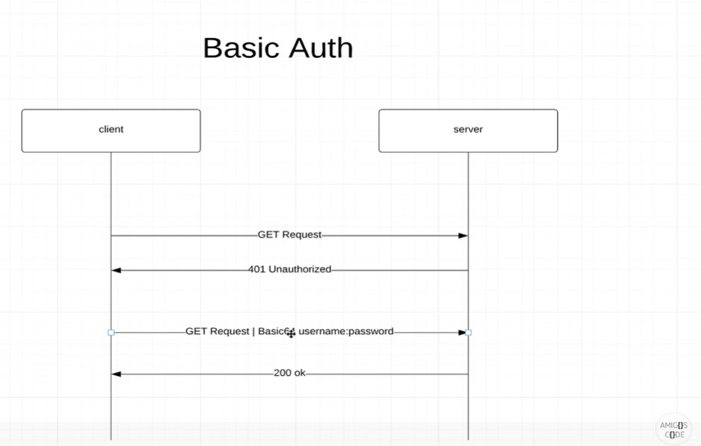

## Basic Auth :beginner:
Basically the client of our web application sends a request to the server, if the user does not send the username and password inside 
request headers, the server returns 401 Unauthorized.
With this method it's necessary to send the username and password (they are encoded through Basic 64) inside the request headers, 
for every single request, for have access to the resources. 
<div align="center">

</div>


This method is used to access to external APIs. But it's not useful with  modern web applications. 
Also, you can't log out.

HACK 

``` Java
CTRL+O //see override methods in intellij
```

The antMatchers() is a Springboot HTTP method used to configure the URL paths from which the Springboot application security should permit requests based on the user’s roles. The antmatchers() method is an overloaded method that receives both the HTTP request methods and the specific URLs as its arguments.
[Nice example](https://www.section.io/engineering-education/springboot-antmatchers/).


